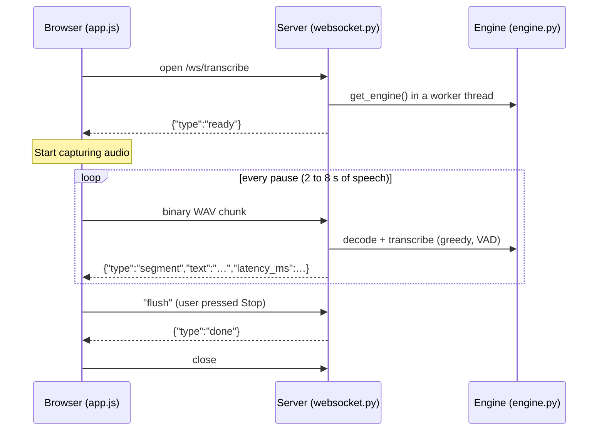

# WORKFLOW.md: UrduBol (اردو بول)

**UrduBol** is a real-time Urdu lecture transcriber that runs entirely on the user's own machine. A browser captures speech from the microphone (or takes an uploaded audio file), a FastAPI server runs an open-weight Whisper model through `faster-whisper` (CTranslate2, int8), and the text streams back into a right-to-left transcript. No audio leaves the device and no paid API is involved.

---

## 1. The 60-second explanation

> Lectures at COMSATS are delivered in Urdu, mixed with English technical terms, and students have no easy way to search or review them. UrduBol turns a lecture into text in real time. You press record (or upload a recording), and the transcript appears after each pause. Everything runs locally on a laptop CPU using an open-source Whisper model fine-tuned for Urdu, so student data stays private and it keeps working when campus internet does not.

**Three points to land with judges**

1. **Open-weight and local.** Whisper (MIT) + faster-whisper/CTranslate2 (MIT), int8-quantized for CPU. No closed API.
2. **Two ways in.** Live microphone and file upload share one transcript view.
3. **Built for Urdu.** Right-to-left transcript, Nastaliq headings, and a prompt that nudges the model to keep English terms (e.g. "Machine Learning") in English.

---

## 2. System architecture

```text
 [Browser]
  ├── Record card:  getUserMedia → AudioContext (16 kHz mono)
  │                 → pause-based chunker → 16-bit WAV (44-byte header)
  ├── Upload card:  drag & drop / file picker / sample chips
  └── Transcript:   RTL view, copy, download .txt, clear, live stats
        │                                   │
        │ WebSocket /ws/transcribe          │ HTTP POST /api/transcribe-file
        ▼                                   ▼
 [FastAPI backend]
  ├── main.py       static files, upload endpoint, model warm-up at startup
  ├── websocket.py  live protocol, runs inference in a worker thread
  └── engine.py     UrduTranscriptionEngine (faster-whisper / CTranslate2)
        │
        ▼
 [Whisper large-v3 Urdu, CT2 int8, CPU]  +  Silero VAD
        │
        ▼
 JSON segments streamed back → transcript, word count, latency
```

---

## 3. Repository structure

```text
urdu-transcriber/
├── app/
│   ├── __init__.py
│   ├── main.py          # App entrypoint, static mounts, upload + health + samples endpoints
│   ├── engine.py        # ASR engine: decoding, prompt, live and file transcription
│   ├── websocket.py     # Live transcription WebSocket route
│   └── static/
│       ├── index.html   # Layout: title, Record, Upload, Transcript, stats
│       ├── style.css    # Emerald and beige theme, RTL/Nastaliq typography
│       └── app.js       # Mic capture, chunking, WebSocket client, upload, UI actions
├── samples/             # Optional demo audio (shows up as "Try a sample" chips)
├── tests/
│   ├── __init__.py
│   └── test_engine.py
├── requirements.txt
├── README.md
├── WORKFLOW.md
└── LICENSE
```

---

## 4. End-to-end pipeline

### Path A: Live recording



1. **Capture.** `getUserMedia` opens the mic with echo cancellation, noise suppression and auto-gain. An `AudioContext` at 16 kHz feeds a `ScriptProcessorNode` (4096-sample blocks, about 0.26 s each).
2. **Chunking.** Each block's loudness (RMS) is measured. A chunk is sent when at least 2 s of audio has been collected and a pause of about 0.5 s follows, or when it reaches 8 s. Silent stretches are dropped, so nothing is sent while nobody is speaking.
3. **Encoding.** The chunk is wrapped in a 16-bit mono WAV header so the server can read it with `scipy.io.wavfile`.
4. **Handshake.** The page only starts capturing after the server sends `ready`, so audio is never sent before the model is loaded.
5. **Inference.** The server decodes the WAV to a `float32` array and calls `transcribe_chunk()`: Urdu forced (`language="ur"`), greedy decoding (`beam_size=1`) for low latency, Silero VAD to remove silence, and an initial prompt containing English terms. Inference runs through `asyncio.to_thread`, so the server stays responsive.
6. **Reply.** Every chunk gets a reply, even when the text is empty, so the status line can show "N sent, N transcribed".
7. **Stop.** The browser sends the final chunk, then `flush`, and waits for `done` so the last words are not lost.

### Path B: Audio upload

1. The user drops a file (MP3, WAV, M4A, OGG or FLAC) or clicks a sample chip.
2. The browser POSTs it to `/api/transcribe-file` as multipart form data.
3. The server saves it to a temp file and calls `transcribe_file()`: WAV files are decoded with scipy, other formats with PyAV. Decoding is followed by Whisper with higher-quality beam search (`beam_size=5`) and VAD.
4. Segments stream back as newline-delimited JSON, one per line, and appear in the transcript as they are produced. The progress bar uses `segment.end / duration`.
5. The temp file is deleted when the stream ends.

### Telemetry and UI

- **Transcript:** each segment is a `<p dir="auto">`, so Urdu flows right-to-left and any English line flows left-to-right. New text fades from a green highlight.
- **Stats bar:** lecture timer, word count, last chunk latency, model status.
- **Actions:** Copy, Download .txt, Clear.

---

## 5. Interfaces

### WebSocket `/ws/transcribe`

| Direction | Message | Meaning |
|---|---|---|
| Server → Client | `{"type":"ready"}` | Model loaded, start sending audio |
| Client → Server | binary WAV | One audio chunk (16-bit, mono) |
| Server → Client | `{"type":"segment","text":"…","latency_ms":1234.5}` | Result for one chunk (`text` may be empty) |
| Client → Server | text `flush` | No more audio; answer everything pending |
| Server → Client | `{"type":"done"}` | All chunks answered |
| Server → Client | `{"type":"error","message":"…"}` | Model failed to load |

### HTTP

| Method and path | Purpose |
|---|---|
| `GET /` | The web app |
| `GET /api/health` | Server liveness (drives the "Model" indicator) |
| `GET /api/samples` | List audio files found in `samples/` |
| `GET /samples/<file>` | Serve a sample file |
| `POST /api/transcribe-file` | Multipart field `file`. Streams NDJSON lines `{"text","start","end","duration"}`, or `{"error":"…"}` |

---

## 6. Design decisions

| Decision | Reason |
|---|---|
| Local inference, no cloud API | Privacy of student audio, no per-minute cost, works on unstable campus internet |
| CTranslate2 + int8 | Runs a large transformer on a laptop CPU without a GPU |
| Pause-based chunks instead of fixed 3 s blocks | Fixed cuts split words in half and hurt accuracy; pauses are natural boundaries |
| Greedy decoding live, beam search for files | Live needs speed; uploaded files can afford the extra quality |
| Model loaded at server startup, work done in a worker thread | The first user never waits on a model download, and the event loop never freezes |
| Prompt with English terms | Whisper in forced-Urdu mode tends to write English words in Urdu script; the prompt biases it to keep them in Latin script |
| `ready` / `flush` / `done` messages | Avoids sending audio too early and losing the final words on Stop |
| Plain CSS, no Tailwind | One fewer CDN dependency; the theme is a handful of CSS variables |

---

## 7. Setup and local development

### Prerequisites

- Python 3.10+
- A virtual environment
- A microphone, and Chrome or Edge (microphone access needs `localhost` or HTTPS)
- Several GB of free disk and RAM for the first model download

### Install

```bash
git clone https://github.com/your-username/urdu-transcriber.git
cd urdu-transcriber
python -m venv venv

# Windows
venv\Scripts\activate
# Linux / macOS
source venv/bin/activate

pip install -r requirements.txt
```

### `requirements.txt`

```text
fastapi
uvicorn
faster-whisper
av
numpy
scipy
python-multipart
```

`python-multipart` is required for file upload. `av` (PyAV) decodes MP3/M4A and must be recent enough for your `faster-whisper` version. `torch` is not needed by `faster-whisper`; keep it only if another part of the project imports it.

### Run

```bash
uvicorn app.main:app --host 127.0.0.1 --port 8000
```

Wait for `✅ UrduTranscriptionEngine loaded successfully!`, then open `http://127.0.0.1:8000`. The first start downloads the model, so it takes longer. Avoid `--reload` for demos; it restarts the server and reloads the model on every file change.

### Configuration

| Setting | Where | Default |
|---|---|---|
| Model | env var `URDUBOL_MODEL` | `kingabzpro/whisper-large-v3-urdu-ct2` |
| Device and quantization | `get_engine()` in `websocket.py` | `cpu`, `int8` |
| English terms for the prompt | `ENGLISH_TERMS` in `engine.py` | CS terms (edit per course) |
| Chunk sizes, pause length, mic sensitivity | top of `app.js` | `MIN_S=2`, `MAX_S=8`, `PAUSE_BLOCKS=2`, `SILENCE_RMS=0.005` |
| Demo files | `samples/` folder | none |

---

## 8. Demo script (about 3 minutes)

1. **Open the page** and point at the status bar: "Model: Ready", all running locally.
2. **Upload tab first.** Click a sample chip (or drop a recording). The transcript fills in segment by segment. This is the safe demo because it does not depend on the room's microphone.
3. **Live recording.** Press *Start recording*, speak a sentence with an English term ("Machine Learning"), pause, and show the text appearing. Point at the status line and latency.
4. **Export.** Press *Download .txt* and *Copy*.
5. **Closing line.** Unplug the Wi-Fi and repeat step 3 (fonts fall back, transcription still works).

---

## 9. Likely questions

| Question | Answer |
|---|---|
| Why not Google or OpenAI speech APIs? | Student data privacy, cost, and reliability on weak campus internet. This runs offline on a laptop. |
| How accurate is it? | It uses a Whisper large-v3 model fine-tuned for Urdu. Domain spellings and technical vocabulary still need work, which is Phase 4. |
| Is it really real-time? | Near real-time. Text appears after each pause, delayed by CPU inference time. Latency is shown in the UI. |
| What happens to English words? | A prompt nudges the model to keep them in English. It is a best-effort improvement, not a guarantee. |
| Is it open source? | Yes, MIT. Whisper and faster-whisper are also MIT-licensed. |
| Can it handle a full lecture? | Upload mode streams results for long files. Live mode runs as long as the browser tab stays open. |

---

## 10. Known limitations

- **Spelling and vocabulary errors** from the model, especially technical terms and names (in progress).
- **CPU latency:** a large model on a laptop CPU can take several seconds per chunk; a GPU or a smaller model reduces this.
- **`ScriptProcessorNode` is deprecated** in browsers; moving to an `AudioWorklet` is future work.
- **Mixed Urdu/English** relies on a prompt, not a true code-switching model.
- **One model instance, no authentication, CORS open to all origins**: fine for a local demo, not for a public deployment.
- **Fonts load from Google Fonts**, so fully offline use falls back to system fonts unless they are self-hosted.
- **No speaker labels** (diarization) and no saved history between sessions.

---

## 11. Troubleshooting

| Symptom | What to check |
|---|---|
| Nothing appears while recording | Read the status line. `0 sent` means the mic is not reaching the app (check browser permission and input device). `N sent, N empty` means the model returned no text. Also check the terminal for `📝 chunk done…` lines and the browser console (F12) for errors. |
| "No sound detected" after 6 seconds | Wrong input device or muted mic. |
| Upload fails with a PyAV/`open()` error | `pip install -U av faster-whisper`, or upload a `.wav`. |
| Very slow first start | The model is downloading; wait for the "loaded" message in the terminal. |
| Model status shows "Server offline" | The server is not running, or the page was opened from a different address. |

---

## 12. Team roles

| Module | Owner | Responsibilities |
|---|---|---|
| **ASR engine and tuning** | **Ramlah** | `engine.py`, model selection, beam/decoding settings, Urdu vocabulary and spelling correction |
| **Frontend and pipeline** | **Ifra Ahmed** | Web Audio capture and chunking, WebSocket and upload integration, UI and RTL rendering, stats and export |

---

## 13. Milestones and roadmap

- [x] **Phase 1: Real-time audio streaming.** WebSocket protocol and browser-side WAV encoding.
- [x] **Phase 2: On-device inference.** CTranslate2 int8 Whisper Urdu engine, run off the event loop.
- [x] **Phase 3: Dashboard.** Emerald and beige bilingual UI, live recording, file upload, samples, copy/export.
- [ ] **Phase 4: Lexicon and post-processing** (in progress, Ramlah). Spelling anomalies and domain vocabulary.
- [ ] **Phase 5: Export and analytics.** SRT subtitles and PDF output. File mode already returns `start`/`end` per segment, which is what SRT needs.
- [ ] **Later:** AudioWorklet capture, per-segment timestamps in the UI, self-hosted fonts, GPU option.

---

## 14. Built with

FastAPI · Uvicorn · faster-whisper · CTranslate2 · OpenAI Whisper (large-v3, Urdu fine-tune) · Silero VAD · PyAV · NumPy · SciPy · Web Audio API · GitHub Copilot as AI pair programmer.

Licensed under the MIT License.